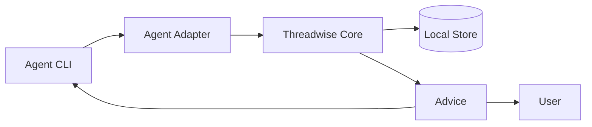
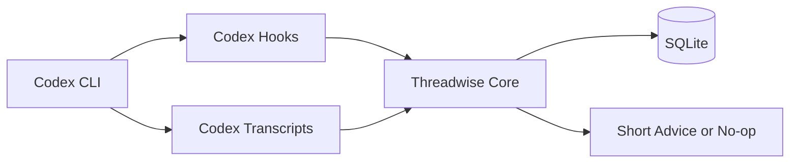

# Threadwise Architecture

## MVP

The MVP is Codex-first.

Threadwise should keep normal Codex usage intact. The user still types into
Codex. Threadwise runs beside it through Codex hooks and local transcript
reading, then gives short advice when the current session should continue,
resume another session, or split into a new agent.

MVP requirements:

- Codex CLI only for the first working release.
- Use Codex `UserPromptSubmit` for pre-prompt advice.
- Use Codex `Stop` or transcript updates to refresh summaries.
- No wrapper command for normal prompt entry.
- No automatic agent launch, resume, or spawning.
- Keep hook execution fast: target under 500 ms, hard timeout under 2 seconds.
- Work offline and local-first.
- Store only short-lived session metadata by default.

Future adapters should reuse the same core contract for Claude Code, OpenCode,
VS Code / Copilot agents, Cursor, and other agent CLIs, but they are not MVP
blockers.

## User Loop

1. User works in Codex normally.
2. Codex runs the Threadwise pre-prompt hook.
3. Threadwise compares the prompt with the current session and recent Codex
   sessions.
4. If confidence is low, Threadwise returns nothing.
5. If confidence is high, Threadwise returns a concise recommendation or a
   focused handoff prompt.

Example:

```text
Recommendation: open a new agent
Reason: this is a read-only test audit and can run in parallel.

Suggested handoff:
Review test coverage for the docs parser. Do not edit files. Return only
missing coverage and risk areas with file references.
```

## Architecture

Keep the design abstract. Agent-specific behavior belongs in adapters.



MVP concrete mapping:



Core responsibilities:

- Normalize hook input and transcript turns.
- Track active session objective, touched files, commands, and open questions.
- Search recent sessions inside the TTL window.
- Score `continue_current`, `resume_existing`, and `open_new_agent`.
- Generate a handoff prompt when a split is recommended.

Adapter responsibilities:

- Install hook instructions.
- Read transcripts.
- Detect active sessions for the current repo.
- Provide resume hints where the agent supports them.

## Storage

Use SQLite for the MVP.

Tables:

- `sessions`: agent, session id, repo root, title, status, timestamps.
- `turns`: session id, role, content, files mentioned, commands mentioned.
- `summaries`: session id, objective, state, touched files, open questions.
- `recommendations`: action, confidence, reason, selected session, timestamp.
- `handoffs`: recommendation id, generated prompt, timestamp.

Do not add a vector database in the first cut. Start with SQLite FTS/BM25 and
metadata boosts. Add embeddings only after real sessions show the baseline is
not good enough.

## Install And Release

Threadwise should feel instant to install and run.

Packaging requirements:

- Ship a single `threadwise` binary where possible.
- Homebrew formula for macOS and Linuxbrew.
- Debian package and apt repository for Linux users.
- Release archives for direct download.
- Multi-arch builds:
  - `darwin-arm64`
  - `darwin-amd64`
  - `linux-amd64`
  - `linux-arm64`
- Smoke-test every release artifact with `threadwise --version` and
  `threadwise doctor`.

Implementation implication:

- Prefer Go or Rust if single-binary distribution is the priority.
- Python is acceptable for prototyping, but packaging is heavier.
- If Python is used first, keep the core portable enough to rewrite or package
  with a standalone tool later.

## Commands

MVP commands:

- `threadwise init codex`: install or print Codex hook configuration.
- `threadwise status`: show active session, related sessions, and advice.
- `threadwise handoff`: print the current split handoff prompt.
- `threadwise sessions`: list recent sessions for the current repo.
- `threadwise explain`: show why the last recommendation was made.
- `threadwise doctor`: validate hooks, transcript access, store, and version.

Hook commands:

- `threadwise hook codex-user-prompt-submit`
- `threadwise hook codex-stop`

## Build Plan

1. Define the normalized event schema.
2. Build the SQLite store.
3. Read Codex transcripts under `~/.codex/sessions`.
4. Detect the active Codex session for the current repo.
5. Implement `threadwise status` using simple keyword/metadata scoring.
6. Implement Codex `UserPromptSubmit` and `Stop` hook commands.
7. Implement `threadwise handoff`.
8. Add `threadwise init codex` and `threadwise doctor`.
9. Add release automation for macOS and Linux multi-arch binaries.
10. Add Homebrew and apt packaging.
11. Tune thresholds with real Codex sessions.
12. Add Claude Code as the second adapter after the Codex MVP is reliable.

## Later

After the Codex MVP works:

- Claude Code adapter.
- OpenCode adapter.
- VS Code / Copilot extension or hook-file integration.
- Cursor plugin or extension integration.
- MCP surface so agents can ask Threadwise for advice.
- Optional embeddings for better similarity search.

## Relevant References

These are useful for memory, session discovery, resume UX, and future adapter
ideas. They are references, not MVP scope.

| Tool | Stars | Forks | Stability | Useful for | Threadwise takeaway |
| --- | ---: | ---: | --- | --- | --- |
| [`memsearch`](https://github.com/zilliztech/memsearch) | ~1.6k | 154 | Strongest adoption; active releases | Cross-agent memory, Markdown source of truth, hybrid retrieval | Do not become broad memory infrastructure in the MVP |
| [`agent-sessions`](https://github.com/jazzyalex/agent-sessions) | 544 | 32 | Usable app; macOS-specific | Multi-agent session browser, resume UX, live agent HUD | Keep the resume/session UX simple and inspectable |
| [`Remnic`](https://github.com/joshuaswarren/remnic) | 73 | 11 | Ambitious, test-heavy, still young | Scoped memory, provenance, correction, MCP/HTTP access | Short-lived session hygiene is enough for now |
| [`ai-sessions-mcp`](https://github.com/yoavf/ai-sessions-mcp) | 27 | 3 | Small but focused | MCP access to Claude, Codex, Gemini, and OpenCode sessions | Good reference for later MCP/session search |
| [`cxresume`](https://github.com/lingtaolf/cxresume) | 12 | 2 | Narrow but practical | Fast Codex session discovery and resume flow | Good reference for Codex-first session discovery |
