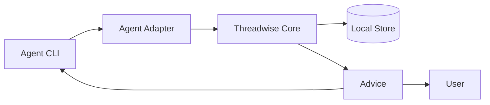
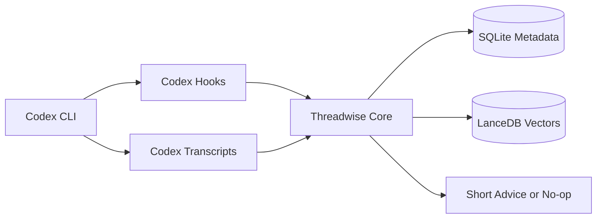

# Threadwise Architecture

## MVP

The MVP is Codex-first.

Threadwise should keep normal Codex usage intact. The user still types into
Codex. Threadwise runs beside it through Codex hooks and local transcript
reading, then gives short advice when the current session should continue,
resume another session, or split into a new agent.

MVP requirements:

- Codex CLI only for the first working release.
- Use Codex `UserPromptSubmit` for pre-prompt advice.
- Use Codex `Stop` or transcript updates to refresh summaries.
- Track agent kind, agent version, adapter version, and supported capabilities
  for compatibility and debugging.
- No wrapper command for normal prompt entry.
- No automatic agent launch, resume, or spawning.
- Keep hook execution fast: target under 500 ms, hard timeout under 2 seconds.
- Use local embeddings for semantic matching.
- Work offline and local-first.
- Store only short-lived session metadata by default.

Future adapters should reuse the same core contract for Claude Code, OpenCode,
VS Code / Copilot agents, Cursor, and other agent CLIs, but they are not MVP
blockers.

## User Loop

1. User works in Codex normally.
2. Codex runs the Threadwise pre-prompt hook.
3. Threadwise compares the prompt with the current session and recent Codex
   sessions.
4. If confidence is low, Threadwise returns nothing.
5. If confidence is high, Threadwise returns a concise recommendation or a
   focused handoff prompt.

Example:

```text
Recommendation: open a new agent
Reason: this is a read-only test audit and can run in parallel.

Suggested handoff:
Review test coverage for the docs parser. Do not edit files. Return only
missing coverage and risk areas with file references.
```

## Architecture

Keep the design abstract. Agent-specific behavior belongs in adapters.



MVP concrete mapping:



Core responsibilities:

- Normalize hook input and transcript turns.
- Maintain the agent registry and capability map.
- Track active session objective, touched files, commands, and open questions.
- Search recent sessions inside the TTL window using content, vectors, and
  project metadata.
- Score `continue_current`, `resume_existing`, and `open_new_agent`.
- Generate a handoff prompt when a split is recommended.

Adapter responsibilities:

- Report agent kind, executable path, version, adapter version, and capabilities.
- Install hook instructions.
- Read transcripts.
- Detect active sessions for the current repo.
- Provide resume hints where the agent supports them.

Normalized agent identity:

| Field | Example | Purpose |
| --- | --- | --- |
| `agent_kind` | `codex`, `claude_code`, `opencode`, `cursor`, `vscode_copilot` | Stable product family |
| `agent_version` | `codex-cli 0.x.y` | Detect behavior and transcript changes |
| `adapter_version` | `tw-codex-adapter 0.x.y` | Debug parser and hook compatibility |
| `executable_path` | `/opt/homebrew/bin/codex` | Know which binary produced the session |
| `capabilities` | `hooks`, `resume`, `transcripts`, `spawn_hint` | Decide what advice Threadwise can safely give |
| `workspace_root` | `/repo/path` | Scope matching to the active project |

The adapter boundary is the agent wiring layer. Each adapter translates one
agent's hooks, transcript layout, resume command, and version detection into
the normalized event schema. The core should not know Codex or Claude-specific
file formats. Agent and adapter versions are tracking metadata only; they are
not primary lookup signals. Ranking should depend on content similarity, repo,
recency, files, commands, and active task state.

Client wiring should be easy:

```text
tw init codex
tw connect codex
tw source add local ~/.codex/sessions --agent codex
tw doctor
```

`init` installs or prints hook config. `connect` auto-detects agent binary,
version, config path, transcript path, and supported capabilities. `source add
local` lets a user register a transcript/session directory explicitly when
auto-detection is wrong or unsupported.

## Storage

Use SQLite for metadata and LanceDB for vectors in the MVP.

SQLite tables:

- `agents`: agent kind, agent version, adapter version, executable path,
  capabilities, first seen, last seen.
- `sessions`: agent id, session id, repo root, title, status, timestamps.
- `turns`: session id, role, content, files mentioned, commands mentioned.
- `summaries`: session id, objective, state, touched files, open questions,
  vector id.
- `recommendations`: action, confidence, reason, selected session, timestamp.
- `handoffs`: recommendation id, generated prompt, timestamp.

LanceDB tables:

- `session_vectors`: vector id, session id, agent id, repo root, summary kind,
  embedding, text hash, created_at.

Search should be hybrid from the start:

- SQLite FTS/BM25 for exact terms, file names, commands, and symbols.
- LanceDB vector search for semantic similarity between prompts and session
  summaries.
- Metadata boosts for same repo, recent activity, same files, and same command
  history.
- Agent identity and version metadata should be used for compatibility filters
  and diagnostics, not as ranking shortcuts.

Embeddings are necessary for useful recommendations. Without them, Threadwise
will miss paraphrases like "audit tests" versus "review coverage" and will
overfit to shared filenames or command names. LanceDB is the preferred vector
store because it is embedded, has a Rust SDK, and is more production-oriented
than `sqlite-vec`. Keep the vector layer behind an internal `VectorIndex`
interface so `sqlite-vec` or brute-force SQLite can still be used as a fallback.

Preferred MVP stack:

- Embedding model: small local ONNX model such as `BAAI/bge-small-en-v1.5` or
  `sentence-transformers/all-MiniLM-L6-v2`.
- Embedding runtime: `fastembed-rs`.
- Metadata store: SQLite.
- Vector store: LanceDB.
- Fallback vector store: `sqlite-vec` or a simple SQLite BLOB column plus
  brute-force cosine search while the dataset is small.

Operational rule: precompute session-summary embeddings after turns stop. The
pre-prompt hook should only embed the new prompt and query cached session
vectors. If embedding fails or times out, fall back to FTS/BM25 and return no
advice unless confidence is high.

## Install And Release

Threadwise should feel instant to install and run.

Packaging requirements:

- Ship a single `tw` binary where possible.
- Homebrew formula for macOS and Linuxbrew.
- Debian package and apt repository for Linux users.
- Release archives for direct download.
- Multi-arch builds:
  - `darwin-arm64`
  - `darwin-amd64`
  - `linux-amd64`
  - `linux-arm64`
- Smoke-test every release artifact with `tw --version` and
  `tw doctor`.

Implementation implication:

- Use Rust for the MVP because LanceDB and `fastembed-rs` both have native
  Rust support.
- Do not use Go for the first implementation if LanceDB is required. The Go
  LanceDB SDK is community-driven and uses CGO/native artifacts, which makes
  packaging less direct for a small installable CLI.
- Go can still be useful later for thin clients or integrations that call a
  stable `tw` CLI/API.
- Keep the vector and embedding layers behind traits so release packaging can
  fall back to a simpler local index if a platform has issues.

## Commands

MVP commands:

- `tw init codex`: install or print Codex hook configuration.
- `tw connect codex`: auto-detect Codex binary, version, config, hooks,
  transcript path, and capabilities.
- `tw source add local <path> --agent <kind>`: register a local
  transcript/session directory explicitly.
- `tw adapters`: list detected agents, versions, and capabilities.
- `tw status`: show active session, related sessions, and advice.
- `tw handoff`: print the current split handoff prompt.
- `tw sessions`: list recent sessions for the current repo.
- `tw explain`: show why the last recommendation was made.
- `tw doctor`: validate hooks, transcript access, store, and version.

Hook commands:

- `tw hook codex-user-prompt-submit`
- `tw hook codex-stop`

## Build Plan

1. Define the normalized event schema.
2. Define the adapter registry and capability model.
3. Build the SQLite metadata store.
4. Add LanceDB-backed `VectorIndex`.
5. Add local embeddings with `fastembed-rs`.
6. Implement Codex auto-detection for binary, version, config, hooks, and
   transcript path.
7. Read Codex transcripts under `~/.codex/sessions`.
8. Detect the active Codex session for the current repo.
9. Implement `tw status` using hybrid search and metadata scoring.
10. Implement Codex `UserPromptSubmit` and `Stop` hook commands.
11. Implement `tw handoff`.
12. Add `tw init codex`, `tw connect codex`,
    `tw source add local`, `tw adapters`, and
    `tw doctor`.
13. Add release automation for macOS and Linux multi-arch binaries.
14. Add Homebrew and apt packaging.
15. Tune thresholds with real Codex sessions.
16. Add Claude Code as the second adapter after the Codex MVP is reliable.

## Later

After the Codex MVP works:

- Claude Code adapter.
- OpenCode adapter.
- VS Code / Copilot extension or hook-file integration.
- Cursor plugin or extension integration.
- MCP surface so agents can ask Threadwise for advice.
- Larger or user-selectable embedding models.

## Relevant References

These are useful for memory, session discovery, resume UX, and future adapter
ideas. They are references, not MVP scope.

Top related tools:

| Tool | Stars | Forks | Stability | Useful for | Threadwise takeaway |
| --- | ---: | ---: | --- | --- | --- |
| [`memsearch`](https://github.com/zilliztech/memsearch) | ~1.6k | 154 | Strongest adoption; active releases | Cross-agent memory, Markdown source of truth, hybrid retrieval | Do not become broad memory infrastructure in the MVP |
| [`agent-sessions`](https://github.com/jazzyalex/agent-sessions) | 544 | 32 | Usable app; macOS-specific | Multi-agent session browser, resume UX, live agent HUD | Keep the resume/session UX simple and inspectable |
| [`Remnic`](https://github.com/joshuaswarren/remnic) | 73 | 11 | Ambitious, test-heavy, still young | Scoped memory, provenance, correction, MCP/HTTP access | Short-lived session hygiene is enough for now |
| [`ai-sessions-mcp`](https://github.com/yoavf/ai-sessions-mcp) | 27 | 3 | Small but focused | MCP access to Claude, Codex, Gemini, and OpenCode sessions | Good reference for later MCP/session search |
| [`cxresume`](https://github.com/lingtaolf/cxresume) | 12 | 2 | Narrow but practical | Fast Codex session discovery and resume flow | Good reference for Codex-first session discovery |

Embedding and vector support:

| Tool | Stars | Forks | Stability | Useful for | Threadwise takeaway |
| --- | ---: | ---: | --- | --- | --- |
| [`fastembed`](https://github.com/qdrant/fastembed) | 2k+ | 196 | Mature lightweight embedding library | Local ONNX embedding generation | Good Python prototype path |
| [`fastembed-rs`](https://github.com/Anush008/fastembed-rs) | 600+ | 89 | Practical Rust embedding library | Local ONNX embedding generation in a compiled binary | Best fit if Rust is chosen for distribution |
| [`LanceDB`](https://github.com/lancedb/lancedb) | 10k+ | 800+ | Strong embedded vector DB | Embedded vector and hybrid search | Preferred MVP vector store |
| [`sqlite-vec`](https://github.com/asg017/sqlite-vec) | 7k+ | 300+ | Pre-v1 but widely watched | Local vector search inside SQLite | Fallback if LanceDB packaging is too heavy |
| [`lancedb-go`](https://github.com/lancedb/lancedb-go) | n/a | n/a | Community SDK; CGO/native artifacts | Go access to LanceDB | Not the MVP path; useful later if Go clients are needed |
