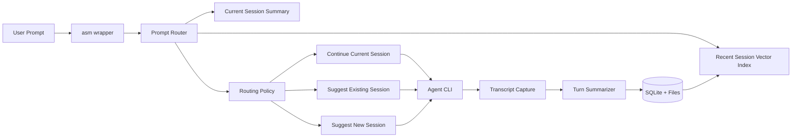
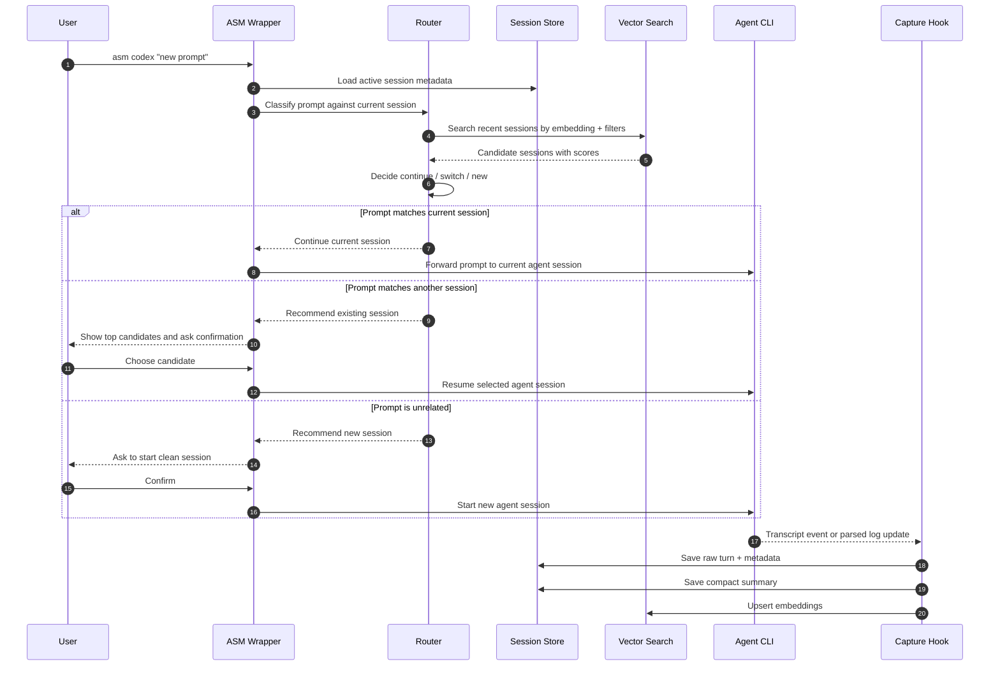
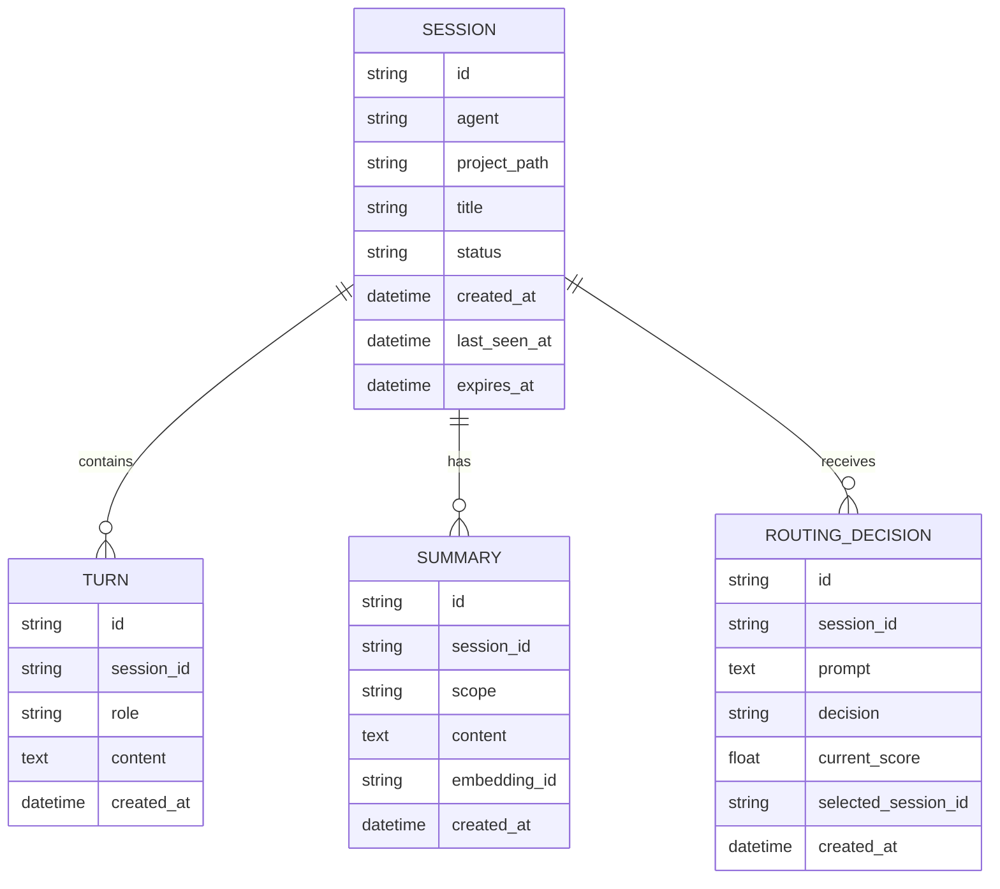
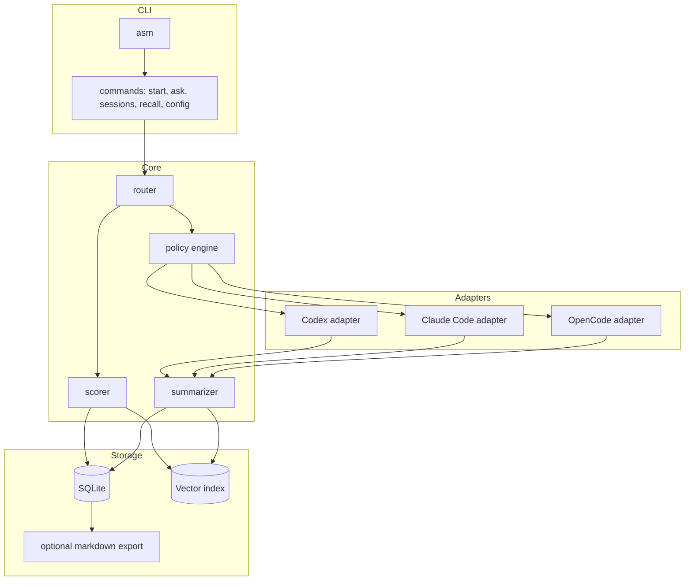

# Agentic Session Manager Architecture

## Positioning

There are existing tools in this space:

- `memsearch`: cross-agent semantic memory for Claude Code, Codex CLI, OpenCode,
  and OpenClaw, using Markdown as source of truth and Milvus as an index.
- `agentmemory`: local Markdown memory with qmd-powered semantic search and
  automatic context injection.
- `cxresume`: focused Codex session discovery and resume tool.
- `agent-sessions`: local macOS session browser for several agent CLIs.
- `ai-sessions-mcp`: MCP server that exposes previous local coding sessions.
- `Remnic`: local-first multi-agent memory with provenance and scoped recall.

This project should stay narrower:

1. Prompt gate before sending work to an agent.
2. Short-lived configurable memory, defaulting to a few days.
3. Session recommendation, not just memory recall.
4. Agent-agnostic adapter layer for Codex, Claude Code, OpenCode, and others.
5. Lightweight local storage with optional vector index backends.

## Core Concept



## Lifecycle Sequence



## Lightweight Storage

Use two layers:

- SQLite for session metadata, turns, summaries, decisions, and TTL.
- Vector index for similarity search over summaries and recent prompts.

Default local options:

- SQLite table with `sqlite-vec` if available.
- LanceDB as an easy embedded vector store.
- Chroma only if we accept a heavier dependency.

Recommended MVP choice: SQLite + LanceDB. It is simple enough to ship quickly
while keeping metadata and vector data local.

## Data Model



## Routing Algorithm

Start deterministic and transparent:

1. Embed the incoming prompt.
2. Compare against the active session summary and last N turns.
3. Search sessions from the TTL window.
4. Apply metadata boosts:
   - same project path
   - same git repo
   - same agent type
   - recently active
   - overlapping files or commands
5. Make a decision using thresholds:
   - `continue` if current session score >= `continue_threshold`
   - `suggest_existing` if another session beats current by `switch_margin`
   - `suggest_new` if all scores are below `new_threshold`
6. Ask for confirmation before switching or starting a new session.

Example config:

```toml
[memory]
ttl_days = 5
max_turns_per_session = 200

[routing]
continue_threshold = 0.72
new_threshold = 0.45
switch_margin = 0.12
top_k = 5

[embedding]
provider = "fastembed"
model = "BAAI/bge-small-en-v1.5"
```

## Components



## Build Plan

### Phase 0: Decide MVP Contract

- CLI name: `asm`.
- First supported agent: Codex CLI.
- First platform: Linux.
- First routing mode: prompt check + recommendation only.
- No automatic prompt injection in MVP.

### Phase 1: Read-Only Session Index

- Discover Codex session files under `~/.codex/sessions`.
- Parse recent transcripts.
- Store session metadata and compact summaries in SQLite.
- Add TTL pruning.
- Add `asm sessions` and `asm recall <query>`.

### Phase 2: Vector Search

- Add embedding provider abstraction.
- Implement local embeddings with FastEmbed.
- Store vectors in LanceDB or sqlite-vec.
- Rank candidate sessions with vector score plus metadata boosts.
- Add `asm explain <query>` to show why a session matched.

### Phase 3: Prompt Router

- Add `asm ask codex "<prompt>"`.
- Compare prompt with active session and recent session index.
- Show one of:
  - continue current session
  - resume suggested session
  - start new session
- Log the decision for threshold tuning.

### Phase 4: Agent Adapters

- Codex adapter: discover, resume, start.
- Claude Code adapter: discover and recommend first, resume later.
- OpenCode adapter: read SQLite/session store.
- Keep adapter contracts small:
  - `discover_sessions()`
  - `read_transcript(session_id)`
  - `start(prompt)`
  - `resume(session_id, prompt)`

### Phase 5: Memory Hygiene

- Configurable TTL by project and by agent.
- Redaction rules for secrets.
- Manual pinning for important sessions.
- Markdown export for inspectable memory.
- `asm prune` and `asm doctor`.

## Suggested Tech Stack

Python is the simplest MVP path:

- `typer` for CLI
- `pydantic` for config and models
- `sqlite-utils` or SQLAlchemy Core for SQLite
- `fastembed` for local embeddings
- `lancedb` for vector search
- `rich` for terminal prompts and tables

Node is also viable, but local embedding support is usually less smooth.

## Step-by-Step Starting Point

1. Create Python project scaffold.
2. Implement config loading from `~/.config/asm/config.toml` and project `.asm.toml`.
3. Build Codex transcript discovery.
4. Create SQLite schema and import command.
5. Add simple keyword search.
6. Add embeddings and vector search.
7. Add route decision command.
8. Add wrapper command that can launch/resume Codex.
9. Tune thresholds with real local sessions.
10. Add Claude Code adapter after the Codex path is reliable.
