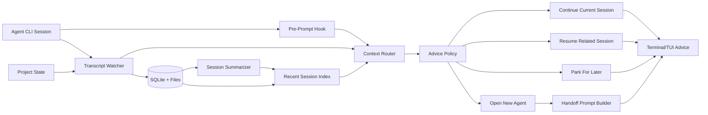
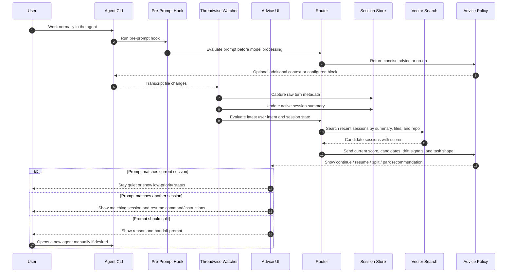
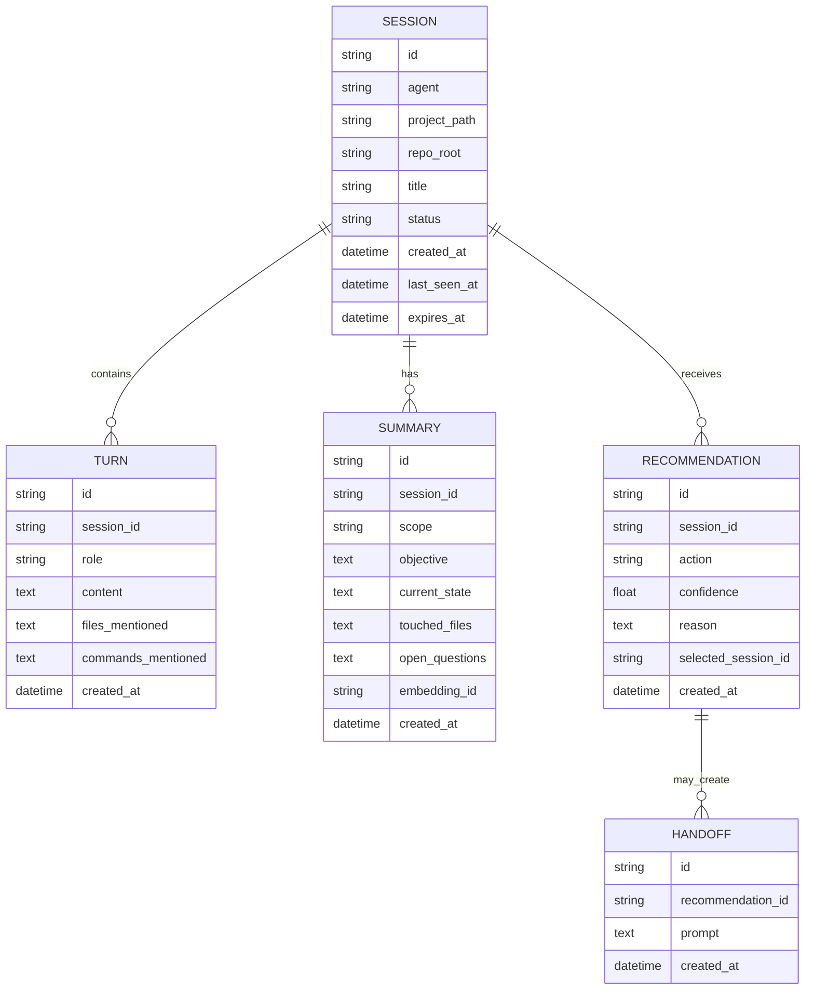
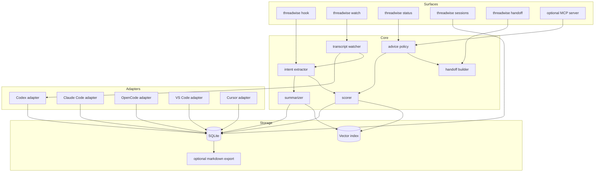

# Threadwise Architecture

## Positioning

Useful existing tools, checked on 2026-05-12:

| Tool | Stars | Forks | Stability | What to learn from it | Threadwise difference |
| --- | ---: | ---: | --- | --- | --- |
| [`memsearch`](https://github.com/zilliztech/memsearch) | ~1.6k | 154 | Strongest adoption; active releases | Cross-agent memory, Markdown source of truth, hybrid retrieval | Threadwise should recommend session actions, not become broad memory infrastructure |
| [`agent-sessions`](https://github.com/jazzyalex/agent-sessions) | 544 | 32 | Usable app; macOS-specific | Multi-agent session browser, resume UX, live agent HUD | Threadwise should stay CLI/hook-first and cross-platform |
| [`Remnic`](https://github.com/joshuaswarren/remnic) | 73 | 11 | Ambitious, test-heavy, still young | Scoped memory, provenance, correction, MCP/HTTP access | Threadwise only needs short-lived session hygiene, not durable personal memory |
| [`ai-sessions-mcp`](https://github.com/yoavf/ai-sessions-mcp) | 27 | 3 | Small but focused | MCP access to Claude, Codex, Gemini, and OpenCode sessions | Threadwise should score whether to continue/resume/split, not just expose search |
| [`cxresume`](https://github.com/lingtaolf/cxresume) | 12 | 2 | Narrow but practical | Fast Codex session discovery and resume flow | Threadwise should generalize this behavior across agents and add advice policy |

Excluded for now: tools with low adoption, unclear maintenance, or broad memory
goals that do not directly inform session routing. Revisit this table before
implementation because stars, forks, and release activity will change.

Threadwise should stay narrower and more opinionated:

1. Keep the user's normal agent loop intact.
2. Watch local session activity instead of sitting between the user and the
   agent.
3. Recommend session hygiene actions: continue, resume, split, or open a new
   agent.
4. Produce concrete handoff prompts when a new agent is useful.
5. Use short-lived configurable memory, defaulting to a few days.
6. Start with one reliable adapter, then keep the same contract for other agent
   CLIs.

The MVP is not a standalone agent wrapper and should not require users to type
prompts through Threadwise. It should feel like a local advisor that notices
when the current thread is getting muddy and says what to do next.

## Product Loop

The intended workflow is:

1. The user works in their agent normally.
2. Threadwise watches the active project, agent transcripts, and recent session
   summaries.
3. Threadwise periodically evaluates whether the current session is still the
   best place for the work.
4. If the work has drifted, duplicated an existing thread, or become a clean
   parallel subtask, Threadwise recommends an action.
5. The user stays in control. Threadwise can prepare a handoff prompt, but it
   does not launch or steer the agent automatically in the MVP.

Example recommendation:

```text
Recommendation: open a new agent
Reason: the current session is implementing docs, but the latest request asks
for a parallel test audit. It can run independently and would add noise here.

Suggested handoff:
Review the test coverage for docs parsing in this repo. Do not edit files.
Return only missing coverage and risk areas with file references.
```

## Core Concept



## Lifecycle Sequence



## Recommendation Types

Threadwise should recommend actions, not routes it controls.

- `continue_current`: the new work matches the current objective and files.
- `resume_existing`: another recent session has stronger continuity than the
  current one.
- `open_new_agent`: the new work is separable, parallelizable, or likely to
  pollute the current context.
- `park_for_later`: the prompt is related but should become a backlog note
  instead of interrupting the active session.
- `summarize_current`: the current session is long enough that the next useful
  action is a checkpoint summary.

`open_new_agent` should be suggested when one or more of these are true:

- The latest request touches a different subsystem than the current thread.
- The task is read-only exploration that can run in parallel.
- The task needs a different stance, such as review, testing, or research.
- The current session has accumulated enough unrelated context to raise drift
  risk.
- The user asks for a side investigation that does not block the immediate next
  step.
- A previous recent session already contains the right local context.

Threadwise should not suggest a new agent for every topic change. Opening a new
agent has a cost, so the policy needs a confidence threshold and a short reason
that a user can reject quickly.

## Hook Integration

The smoothest path is a pre-prompt hook when the agent supports it, with
transcript watching as the fallback.

| Surface | Integration | Use first | Notes |
| --- | --- | --- | --- |
| [Codex CLI](https://developers.openai.com/codex/hooks) | `UserPromptSubmit`, `Stop`, transcript files | Yes | Native lifecycle hooks behind `features.codex_hooks = true`; good first CLI adapter |
| [Claude Code](https://code.claude.com/docs/en/hooks) | `UserPromptSubmit`, `Stop`, `SubagentStop`, transcript files | Yes | Similar pre-prompt hook semantics; should be built beside Codex, not later |
| [VS Code / Copilot agents](https://code.visualstudio.com/docs/copilot/customization/hooks) | Preview agent hooks, `.github/hooks/*.json`, custom agents, plugins | Yes | Good editor path because hooks are designed across local, background, and cloud agents |
| [Cursor](https://cursor.com/marketplace/hooks/userpromptsubmit) | Plugin hooks and marketplace plugin model | Yes | Treat as editor/plugin adapter; verify exact local hook packaging during implementation |
| [OpenCode](https://opencode.ai/docs/plugins/) | Plugins, TUI prompt events, session/tool events | Later | Useful event surface, but exact blocking pre-submit behavior needs implementation proof |
| Other agents | Transcript watcher, MCP, or editor extension | Later | Add once the adapter contract is stable |

The adapter contract should normalize these events:

- `prompt_submit`: prompt text, cwd, session id, transcript path, source agent.
- `session_start`: new or resumed session metadata.
- `turn_stop`: final assistant message and transcript pointer.
- `subagent_start` / `subagent_stop`: child agent metadata when available.
- `tool_use`: optional signal for future safety and audit features.

Hook-capable agents should use `prompt_submit` for smooth advice. Agents without
hooks should still work through transcript watching and one-shot `status`.

For Codex, Threadwise should install or document a small hook like:

```json
{
  "hooks": {
    "UserPromptSubmit": [
      {
        "hooks": [
          {
            "type": "command",
            "command": "threadwise hook codex-user-prompt-submit",
            "timeout": 5,
            "statusMessage": "Checking thread context"
          }
        ]
      }
    ],
    "Stop": [
      {
        "hooks": [
          {
            "type": "command",
            "command": "threadwise hook codex-stop",
            "timeout": 10,
            "statusMessage": "Updating thread summary"
          }
        ]
      }
    ]
  }
}
```

The hook should be conservative:

- Fast path under one second for normal prompts.
- Never launch a new agent automatically.
- Add short context only when useful, such as "this looks like a separate
  review task; consider opening a new agent".
- Block only for strong policy cases, such as a pasted secret or an explicit
  user setting that requires confirmation before context switches.
- Record evidence and let `threadwise explain` show the details outside the
  agent prompt.

This gives a smooth UX without becoming a wrapper. The user still types into
their agent, but Threadwise can speak at the exact moment a context split
matters.

## Advisor Surfaces

Start with low-friction surfaces, ordered by how well they preserve the user's
normal agent loop:

- `threadwise hook codex-user-prompt-submit`: Codex pre-prompt hook command.
- `threadwise hook claude-user-prompt-submit`: Claude Code pre-prompt hook
  command.
- VS Code / Copilot hook command from `.github/hooks/*.json`.
- Cursor plugin hook command where available.
- `threadwise watch`: a read-only terminal sidecar that follows agent session
  files and prints advice when hooks are unavailable or disabled.
- `threadwise status`: a one-shot summary of the active session, related
  sessions, and recommended action.
- `threadwise handoff`: generates a focused prompt for a new agent based
  on the current recommendation.
- `threadwise sessions`: lists recent sessions with titles, projects, last
  activity, and short summaries.
- `threadwise explain`: explains why a recommendation was made.

Possible later surfaces:

- Terminal status line integration.
- Desktop notification when a high-confidence split is detected.
- MCP tool that lets an agent ask Threadwise for session advice.
- VS Code extension panel that shows active thread health and matching sessions.
- Cursor extension/plugin surface with the same status, handoff, and explain
  actions.

The MCP option is useful because it keeps the user inside their existing agent
loop. The agent can ask Threadwise, "Should this be a new agent?" and
Threadwise can answer with evidence and a handoff prompt without becoming the
primary CLI.

## Lightweight Storage

Use two layers:

- SQLite for session metadata, turns, summaries, recommendations, and TTL.
- Vector index for similarity search over summaries, recent prompts, touched
  files, commands, and handoff text.

Default local options:

- SQLite table with `sqlite-vec` if available.
- LanceDB as an easy embedded vector store.
- Chroma only if we accept a heavier dependency.

Recommended MVP choice: SQLite first, then add LanceDB or `sqlite-vec` once the
read-only watcher and recommendation model are useful. A keyword/BM25 baseline
is acceptable before embeddings.

## Data Model



## Scoring Algorithm

Start deterministic and transparent:

1. Parse the latest user turn and extract intent, files, commands, and task
   stance.
2. Compare the turn against the active session summary and last N turns.
3. Search sessions from the TTL window.
4. Apply metadata boosts:
   - same project path
   - same git repo
   - same agent type
   - recently active
   - overlapping files or commands
   - matching task stance, such as implementation, review, testing, or research
5. Detect split signals:
   - different files or subsystem from current objective
   - read-only side quest
   - user asks for multiple independent tasks
   - session length or topic count exceeds configured limits
   - high match to a different recent session
6. Make an advisory decision using thresholds:
   - `continue_current` if current score is high and split score is low
   - `resume_existing` if another session beats current by `resume_margin`
   - `open_new_agent` if split score is high and the task can run independently
   - `park_for_later` if related but not urgent
   - `summarize_current` if the session is too long or state is unclear
7. Store the recommendation and the evidence used to make it.

Example config:

```toml
[memory]
ttl_days = 5
max_turns_per_session = 200

[hooks]
codex = true
claude_code = true
vscode = true
cursor = true
opencode = false
prompt_timeout_ms = 5000

[routing]
continue_threshold = 0.72
resume_margin = 0.12
split_threshold = 0.78
new_agent_min_independence = 0.65
top_k = 5

[embedding]
provider = "fastembed"
model = "BAAI/bge-small-en-v1.5"
```

## Components



## Build Plan

### Phase 0: Decide MVP Contract

- Product name: Threadwise.
- Supported-agent target: Codex CLI, Claude Code, OpenCode, VS Code / Copilot
  agents, Cursor, and any future agent with hooks, transcripts, MCP, or editor
  extension points.
- First platform: Linux for CLI work; editor integrations should avoid
  Linux-only assumptions.
- First integration class: native pre-prompt hook plus transcript watcher.
- No wrapper command for normal prompt entry.
- No automatic agent launch or resume.
- No automatic new-agent spawning.
- One adapter contract for every surface: CLI hook, editor hook, plugin, MCP,
  and transcript watcher.

### Phase 1: Adapter Contract And Storage

- Define normalized events: `prompt_submit`, `session_start`, `turn_stop`,
  `subagent_start`, `subagent_stop`, and `tool_use`.
- Define normalized session identity across agent name, project path, repo root,
  transcript path, and session id.
- Create adapter capability flags: `pre_prompt_hook`, `stop_hook`,
  `subagent_events`, `transcript_read`, `resume_hint`, `editor_panel`.
- Store session metadata and compact summaries in SQLite.
- Add TTL pruning.

### Phase 2: First CLI Adapters

- Add Codex adapter: `UserPromptSubmit`, `Stop`, transcript discovery under
  `~/.codex/sessions`.
- Add Claude Code adapter: `UserPromptSubmit`, `Stop`, `SubagentStop`,
  transcript discovery under Claude project session storage.
- Read hook JSON from stdin and normalize prompt, cwd, session id, turn id,
  transcript path, agent name, and source event.
- Return `additionalContext` only for high-confidence advice.
- Support optional blocking for configured policy cases.
- Add stop hooks to update summaries after each turn.

### Phase 3: Recommendation Baseline

- Extract simple intent signals from the latest user turns.
- Track objective, touched files, commands, and open questions per session.
- Implement keyword/BM25 matching before embeddings.
- Add the first policy rules for `continue_current`, `resume_existing`,
  `open_new_agent`, and `summarize_current`.
- Add `threadwise explain` so recommendations are inspectable.

### Phase 4: Editor Integrations

- Add VS Code / Copilot hook configuration support using workspace hook files
  such as `.github/hooks/*.json`.
- Add a VS Code extension or command surface for active thread health, matching
  sessions, handoff prompt, and explain output.
- Add Cursor plugin integration if local plugin hooks can run Threadwise
  commands with prompt/session context.
- Keep editor integrations thin: they should call the same local Threadwise CLI
  or daemon API used by CLI hooks.

### Phase 5: New-Agent Handoff

- Add `threadwise handoff` for the current recommendation.
- Generate a prompt containing objective, boundaries, relevant files, required
  stance, and expected output.
- Include explicit coordination language, such as "do not edit files" for
  explorer-style tasks or "own only these files" for worker-style tasks.
- Store handoffs so the user can see which session spawned which side task.

### Phase 6: Watch Mode

- Add `threadwise watch`.
- Follow agent transcript updates and refresh active session summaries.
- Print advice only when confidence is high or the user asks for status.
- Support a quiet mode that only reports `open_new_agent` and
  `resume_existing`.
- Add a small feedback command to mark recommendations as useful or wrong.

### Phase 7: Embeddings And Tuning

- Add embedding provider abstraction.
- Implement local embeddings with FastEmbed.
- Store vectors in LanceDB or `sqlite-vec`.
- Rank candidate sessions with vector score plus metadata boosts.
- Tune thresholds with real local sessions and feedback logs.

### Phase 8: Additional Agent Adapters

- Codex adapter: hook, discover, and read transcripts.
- Claude Code adapter: hook, discover, and read transcripts.
- OpenCode adapter: plugin/TUI events where available, plus transcript/session
  observation.
- VS Code adapter: hook files, extension panel, and custom-agent hook support.
- Cursor adapter: plugin hooks, marketplace packaging, and extension-style UI
  where available.
- Other adapters: Gemini CLI, Copilot CLI, OpenHands, and any agent with stable
  transcript storage or hook events.
- Keep adapter contracts small:
  - `discover_sessions()`
  - `read_transcript(session_id)`
  - `detect_active_session(project_path)`
  - `session_resume_hint(session_id)`
  - `install_hook_instructions(project_path)`
  - `install_editor_integration(project_path)`

### Phase 9: Memory Hygiene

- Configurable TTL by project and by agent.
- Redaction rules for secrets.
- Manual pinning for important sessions.
- Markdown export for inspectable memory.
- `threadwise prune` and `threadwise doctor`.

## Suggested Tech Stack

Python is the simplest MVP path:

- `typer` for CLI
- `pydantic` for config and models
- SQLite with `sqlite-utils` or SQLAlchemy Core
- `watchfiles` or polling for transcript updates
- `rich` for terminal status and recommendation panels
- SQLite FTS or `rank-bm25` for the first matching baseline
- `fastembed` plus LanceDB or `sqlite-vec` after the baseline works

Editor integrations will likely need TypeScript:

- VS Code extension API for panel/commands/status.
- Cursor plugin or extension packaging if local hooks are available.
- A thin client that shells out to `threadwise` or calls a local daemon.

Node is viable for the whole project, but local embedding support is usually
less smooth than Python.

## Step-by-Step Starting Point

1. Create Python project scaffold for `threadwise`.
2. Implement config loading from `~/.config/threadwise/config.toml` and project
   `.threadwise.toml`.
3. Define the adapter event schema and capability flags before writing any
   agent-specific code.
4. Create SQLite schema and import command.
5. Build Codex and Claude Code transcript readers.
6. Add active-session detection for the current repo.
7. Add `threadwise status` with objective, recent turns, and related sessions.
8. Add Codex and Claude Code `UserPromptSubmit` hook commands.
9. Add simple keyword/BM25 search.
10. Add deterministic recommendation rules.
11. Add `threadwise handoff` for new-agent suggestions.
12. Add VS Code hook-file generation and a minimal extension/command surface.
13. Add Cursor plugin packaging if its hook runtime can call Threadwise
    locally.
14. Add `threadwise watch` as a fallback and sidecar.
15. Add embeddings after real transcripts show where keyword matching fails.
16. Add OpenCode and other adapters against the same event schema.
