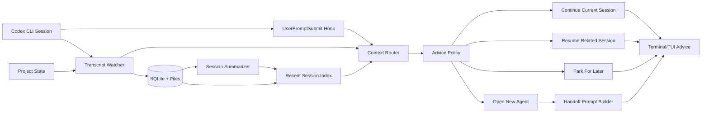
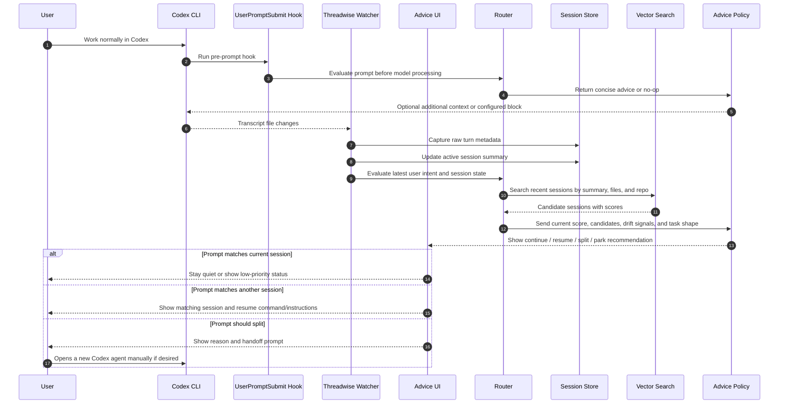
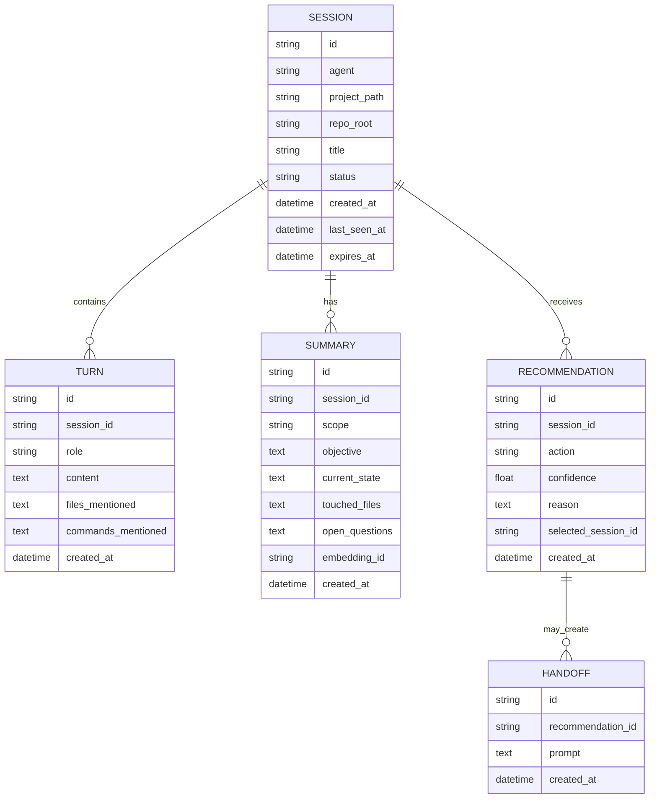
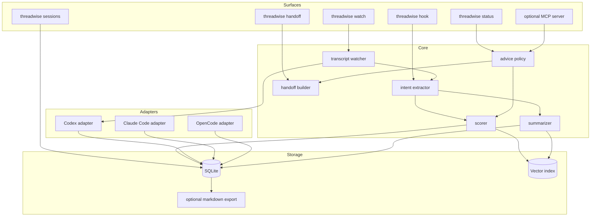

# Threadwise Architecture

## Positioning

There are existing tools in this space:

- `memsearch`: cross-agent semantic memory for Claude Code, Codex CLI, OpenCode,
  and OpenClaw, using Markdown as source of truth and Milvus as an index.
- `agentmemory`: local Markdown memory with qmd-powered semantic search and
  automatic context injection.
- `cxresume`: focused Codex session discovery and resume tool.
- `agent-sessions`: local macOS session browser for several agent CLIs.
- `ai-sessions-mcp`: MCP server that exposes previous local coding sessions.
- `Remnic`: local-first multi-agent memory with provenance and scoped recall.

Threadwise should stay narrower and more opinionated:

1. Keep the user's normal Codex loop intact.
2. Watch local session activity instead of sitting between the user and Codex.
3. Recommend session hygiene actions: continue, resume, split, or open a new
   agent.
4. Produce concrete handoff prompts when a new agent is useful.
5. Use short-lived configurable memory, defaulting to a few days.
6. Start with Codex, but keep a small adapter layer for other agent CLIs later.

The MVP is not a standalone agent wrapper and should not require users to type
prompts through Threadwise. It should feel like a local advisor that notices
when the current thread is getting muddy and says what to do next.

## Product Loop

The intended workflow is:

1. The user works in Codex normally.
2. Threadwise watches the active project, Codex transcripts, and recent session
   summaries.
3. Threadwise periodically evaluates whether the current session is still the
   best place for the work.
4. If the work has drifted, duplicated an existing thread, or become a clean
   parallel subtask, Threadwise recommends an action.
5. The user stays in control. Threadwise can prepare a handoff prompt, but it
   does not launch or steer Codex automatically in the MVP.

Example recommendation:

```text
Recommendation: open a new Codex agent
Reason: the current session is implementing docs, but the latest request asks
for a parallel test audit. It can run independently and would add noise here.

Suggested handoff:
Review the test coverage for docs parsing in this repo. Do not edit files.
Return only missing coverage and risk areas with file references.
```

## Core Concept



## Lifecycle Sequence



## Recommendation Types

Threadwise should recommend actions, not routes it controls.

- `continue_current`: the new work matches the current objective and files.
- `resume_existing`: another recent session has stronger continuity than the
  current one.
- `open_new_agent`: the new work is separable, parallelizable, or likely to
  pollute the current context.
- `park_for_later`: the prompt is related but should become a backlog note
  instead of interrupting the active session.
- `summarize_current`: the current session is long enough that the next useful
  action is a checkpoint summary.

`open_new_agent` should be suggested when one or more of these are true:

- The latest request touches a different subsystem than the current thread.
- The task is read-only exploration that can run in parallel.
- The task needs a different stance, such as review, testing, or research.
- The current session has accumulated enough unrelated context to raise drift
  risk.
- The user asks for a side investigation that does not block the immediate next
  step.
- A previous recent session already contains the right local context.

Threadwise should not suggest a new agent for every topic change. Opening a new
agent has a cost, so the policy needs a confidence threshold and a short reason
that a user can reject quickly.

## Hook Integration

The smoothest path is a pre-prompt hook when the agent supports it, with
transcript watching as the fallback.

- Codex CLI supports lifecycle hooks behind `features.codex_hooks = true`.
  `UserPromptSubmit` runs before the prompt is processed, receives the prompt
  on stdin, and can add developer context or block the prompt.
- Claude Code supports `UserPromptSubmit` hooks with similar behavior: inspect
  the submitted prompt, add context, or block processing.
- OpenCode exposes plugin hooks and TUI prompt events. Use those for status,
  prompt append, and tool/session observation, but treat exact pre-submit
  blocking as adapter-specific until verified in implementation.

For Codex, Threadwise should install or document a small hook like:

```json
{
  "hooks": {
    "UserPromptSubmit": [
      {
        "hooks": [
          {
            "type": "command",
            "command": "threadwise hook codex-user-prompt-submit",
            "timeout": 5,
            "statusMessage": "Checking thread context"
          }
        ]
      }
    ],
    "Stop": [
      {
        "hooks": [
          {
            "type": "command",
            "command": "threadwise hook codex-stop",
            "timeout": 10,
            "statusMessage": "Updating thread summary"
          }
        ]
      }
    ]
  }
}
```

The hook should be conservative:

- Fast path under one second for normal prompts.
- Never launch a new agent automatically.
- Add short context only when useful, such as "this looks like a separate
  review task; consider opening a new agent".
- Block only for strong policy cases, such as a pasted secret or an explicit
  user setting that requires confirmation before context switches.
- Record evidence and let `threadwise explain` show the details outside the
  Codex prompt.

This gives a smooth UX without becoming a wrapper. The user still types into
Codex, but Threadwise can speak at the exact moment a context split matters.

## Advisor Surfaces

Start with low-friction surfaces, ordered by how well they preserve the Codex
loop:

- `threadwise hook codex-user-prompt-submit`: a Codex `UserPromptSubmit` hook
  that returns small advisory context or blocks only when configured to do so.
- `threadwise watch`: a read-only terminal sidecar that follows Codex session
  files and prints advice when hooks are unavailable or disabled.
- `threadwise status`: a one-shot summary of the active session, related
  sessions, and recommended action.
- `threadwise handoff`: generates a focused prompt for a new Codex agent based
  on the current recommendation.
- `threadwise sessions`: lists recent sessions with titles, projects, last
  activity, and short summaries.
- `threadwise explain`: explains why a recommendation was made.

Possible later surfaces:

- Terminal status line integration.
- Desktop notification when a high-confidence split is detected.
- MCP tool that lets Codex ask Threadwise for session advice.
- Editor panel that shows active thread health and matching sessions.

The MCP option is useful because it keeps the user inside the Codex loop. Codex
can ask Threadwise, "Should this be a new agent?" and Threadwise can answer with
evidence and a handoff prompt without becoming the primary CLI.

## Lightweight Storage

Use two layers:

- SQLite for session metadata, turns, summaries, recommendations, and TTL.
- Vector index for similarity search over summaries, recent prompts, touched
  files, commands, and handoff text.

Default local options:

- SQLite table with `sqlite-vec` if available.
- LanceDB as an easy embedded vector store.
- Chroma only if we accept a heavier dependency.

Recommended MVP choice: SQLite first, then add LanceDB or `sqlite-vec` once the
read-only watcher and recommendation model are useful. A keyword/BM25 baseline
is acceptable before embeddings.

## Data Model



## Scoring Algorithm

Start deterministic and transparent:

1. Parse the latest user turn and extract intent, files, commands, and task
   stance.
2. Compare the turn against the active session summary and last N turns.
3. Search sessions from the TTL window.
4. Apply metadata boosts:
   - same project path
   - same git repo
   - same agent type
   - recently active
   - overlapping files or commands
   - matching task stance, such as implementation, review, testing, or research
5. Detect split signals:
   - different files or subsystem from current objective
   - read-only side quest
   - user asks for multiple independent tasks
   - session length or topic count exceeds configured limits
   - high match to a different recent session
6. Make an advisory decision using thresholds:
   - `continue_current` if current score is high and split score is low
   - `resume_existing` if another session beats current by `resume_margin`
   - `open_new_agent` if split score is high and the task can run independently
   - `park_for_later` if related but not urgent
   - `summarize_current` if the session is too long or state is unclear
7. Store the recommendation and the evidence used to make it.

Example config:

```toml
[memory]
ttl_days = 5
max_turns_per_session = 200

[hooks]
codex_user_prompt_submit = true
codex_stop = true
prompt_timeout_ms = 5000

[routing]
continue_threshold = 0.72
resume_margin = 0.12
split_threshold = 0.78
new_agent_min_independence = 0.65
top_k = 5

[embedding]
provider = "fastembed"
model = "BAAI/bge-small-en-v1.5"
```

## Components



## Build Plan

### Phase 0: Decide MVP Contract

- Product name: Threadwise.
- First supported agent: Codex CLI.
- First platform: Linux.
- First integration: Codex `UserPromptSubmit` hook plus transcript watcher.
- No wrapper command for normal prompt entry.
- No automatic Codex launch or resume.
- No automatic new-agent spawning.

### Phase 1: Codex Session Observer

- Discover Codex session files under `~/.codex/sessions`.
- Identify the active session for the current project.
- Parse recent transcripts.
- Store session metadata and compact summaries in SQLite.
- Add TTL pruning.
- Add `threadwise sessions` and `threadwise status`.

### Phase 2: Codex Hook

- Add `threadwise hook codex-user-prompt-submit`.
- Read Codex hook JSON from stdin and extract `prompt`, `cwd`,
  `session_id`, `turn_id`, and `transcript_path`.
- Return `additionalContext` only for high-confidence advice.
- Support optional blocking for configured policy cases.
- Add `threadwise hook codex-stop` to update summaries after each turn.

### Phase 3: Recommendation Baseline

- Extract simple intent signals from the latest user turns.
- Track objective, touched files, commands, and open questions per session.
- Implement keyword/BM25 matching before embeddings.
- Add the first policy rules for `continue_current`, `resume_existing`,
  `open_new_agent`, and `summarize_current`.
- Add `threadwise explain` so recommendations are inspectable.

### Phase 4: New-Agent Handoff

- Add `threadwise handoff` for the current recommendation.
- Generate a prompt containing objective, boundaries, relevant files, required
  stance, and expected output.
- Include explicit coordination language, such as "do not edit files" for
  explorer-style tasks or "own only these files" for worker-style tasks.
- Store handoffs so the user can see which session spawned which side task.

### Phase 5: Watch Mode

- Add `threadwise watch`.
- Follow Codex transcript updates and refresh active session summaries.
- Print advice only when confidence is high or the user asks for status.
- Support a quiet mode that only reports `open_new_agent` and
  `resume_existing`.
- Add a small feedback command to mark recommendations as useful or wrong.

### Phase 6: Embeddings And Tuning

- Add embedding provider abstraction.
- Implement local embeddings with FastEmbed.
- Store vectors in LanceDB or `sqlite-vec`.
- Rank candidate sessions with vector score plus metadata boosts.
- Tune thresholds with real local sessions and feedback logs.

### Phase 7: Agent Adapters

- Codex adapter: hook, discover, and read transcripts.
- Claude Code adapter: hook, discover, and recommend first.
- OpenCode adapter: read SQLite/session store.
- Keep adapter contracts small:
  - `discover_sessions()`
  - `read_transcript(session_id)`
  - `detect_active_session(project_path)`
  - `session_resume_hint(session_id)`
  - `install_hook_instructions(project_path)`

### Phase 8: Memory Hygiene

- Configurable TTL by project and by agent.
- Redaction rules for secrets.
- Manual pinning for important sessions.
- Markdown export for inspectable memory.
- `threadwise prune` and `threadwise doctor`.

## Suggested Tech Stack

Python is the simplest MVP path:

- `typer` for CLI
- `pydantic` for config and models
- SQLite with `sqlite-utils` or SQLAlchemy Core
- `watchfiles` or polling for transcript updates
- `rich` for terminal status and recommendation panels
- SQLite FTS or `rank-bm25` for the first matching baseline
- `fastembed` plus LanceDB or `sqlite-vec` after the baseline works

Node is also viable, but local embedding support is usually less smooth.

## Step-by-Step Starting Point

1. Create Python project scaffold for `threadwise`.
2. Implement config loading from `~/.config/threadwise/config.toml` and project
   `.threadwise.toml`.
3. Build Codex transcript discovery under `~/.codex/sessions`.
4. Create SQLite schema and import command.
5. Add active-session detection for the current repo.
6. Add `threadwise status` with objective, recent turns, and related sessions.
7. Add `threadwise hook codex-user-prompt-submit`.
8. Add simple keyword/BM25 search.
9. Add deterministic recommendation rules.
10. Add `threadwise handoff` for new-agent suggestions.
11. Add `threadwise watch` as a fallback and sidecar.
12. Add embeddings after real transcripts show where keyword matching fails.
13. Add non-Codex adapters only after the Codex hook path is reliable.
